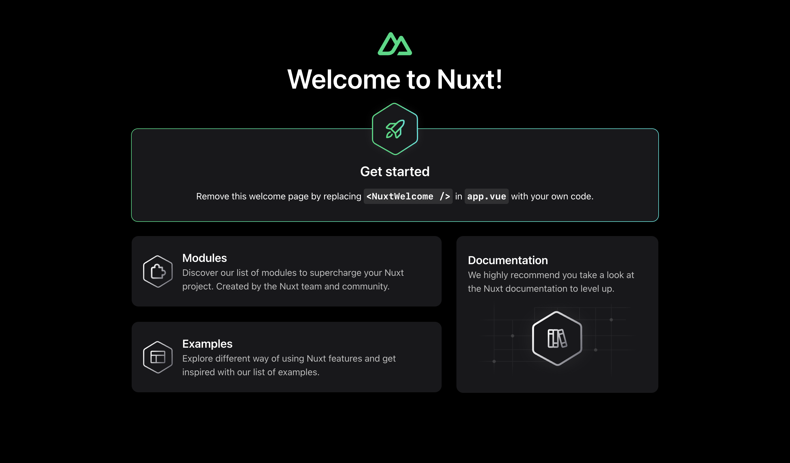
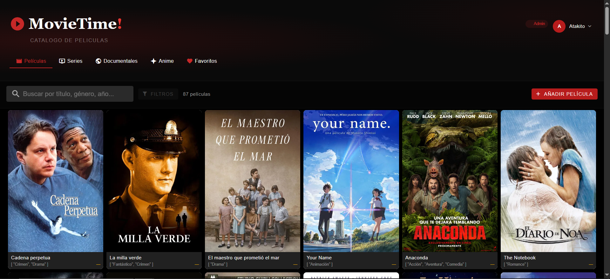
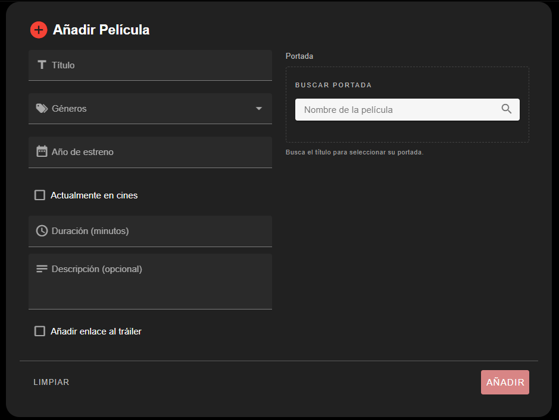
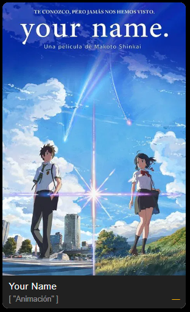
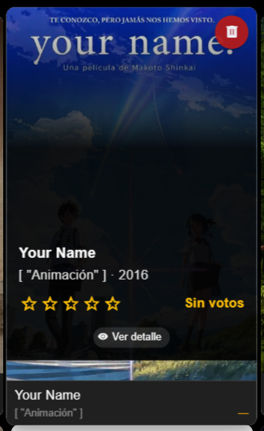
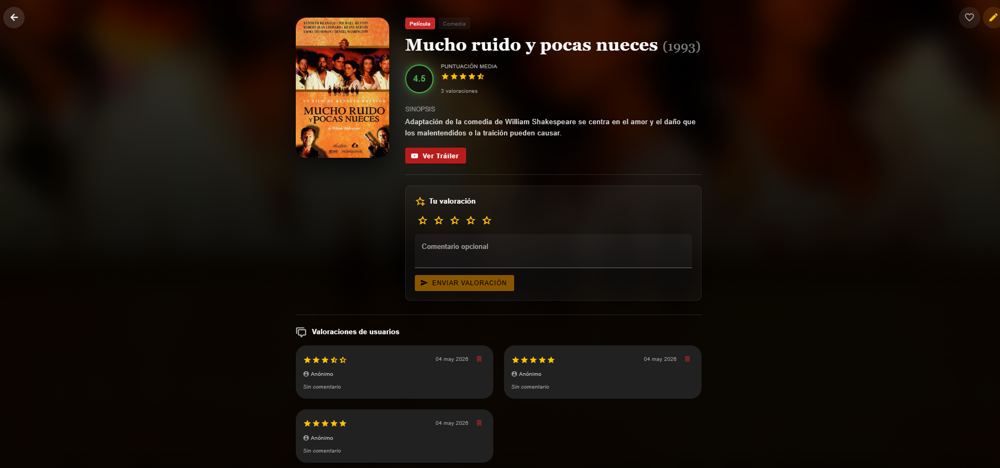
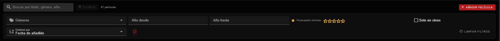
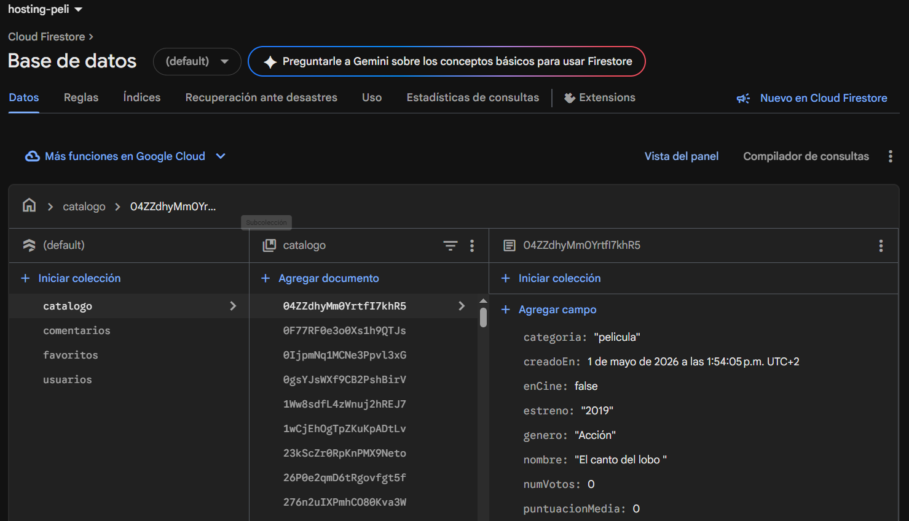

# P3
## Practica 3
> Realizado por Pablo Martín Nebreda y Daniel García Marquez

  
  
  
  
    
  

---

Se creeara una aplicación web con arquitectura Serverless que permitirá a los usuarios gestionar y consultar un catálogo compartido de películas en tiempo real. Los elementos del catálogo serán películas, y cada película podrá ser puntuada por cualquier usuario. La aplicación estará orientada a un catálogo colaborativo, donde los usuarios podrán agregar películas y asignarles una puntuación. El hosting de la base de datos será gestionada con Firestore, lo que permitirá la sincronización en tiempo real de los cambios realizados en el catálogo de películas

Para completar esta practica nuestros objetivos fueron estos:

- [x] Registrar películas en el catálogo.
- [x] Consultar las películas del catálogo.
- [x] Buscar películas por género, año o si siguen en cartelera.
- [x] Añadir valoraciones y comentarios sobre una película.
- [x] Consultar las valoraciones de una película.
- [x] Calcular la valoración media de una película.
- [x] Buscar películas cuyos comentarios contengan una palabra determinada.
- [x] Obtener estadísticas generales del catálogo.
- [x] Eliminar peliculas y editar
##### Extras:
- [x] Sistema de cuentas
- [x] Añadir diferentes tipos de entretenimiento audiovisual
- [x] Wishlist de peliculas

Para implementar este webapp vamos a necesitar gestionar varios tipos de recursos como:

•  Base de datos con peliculas, cada una con su titulo, genero, año, sinopsis e imagen de portada

•  Base de datos con valoraciones, cada una con su valoracion en estrellas del 1 al 5, comentario y nombre de usuario

⚠︎ Para visitar la pagina web este es el link -> https://hosting-peli.web.app/ <-

## Versiones del codigo - Estable v1.0

## IMPORTANTE
⚠︎ Este codigo usa la version 3 de los componentes: Vue y Pinia. `npm install vuetify@3.12.5 & npm install @pinia/nuxt pinia`

⚠︎ Este codigo tiene implementacion con Firebase. Si se quiere hacer hosting propio, mirar la carpeta de stores para saber que catalogos hay que añadir.

## Preparacion
Lo primero que hicimos fue instalar todos componentes necesarios para la realización de la práctica: 
- El componente Vue: es un framework progresivo de JavaScript para construir interfaces de usuario. 
- El componente Nuxt: se construye encima de Vue y facilita el desarrollo de apps completas, facilitando enrutamiento, organización, etc. 
- El componente Vuetify: Librería de componentes visuales 
- El componente Pinia: Librería de gestión para guardar y compartir datos entre diferentes componentes o páginas de la app.
## Inicio de la practica
### Creacion y modificacion del template inicial
Una vez todo instalado el siguiente paso es crear tanto la plantilla inicial usando de base los código ejemplo proporcionados.

A partir de eso le empezamos a dar forma a la página web que queríamos creando las carpetas pages, components, stores, layouts y services cuyos archivos iniciales creados son el index en la carpeta pages, el primer componente en la carpeta components y el default en la carpeta layout encargados de mostrar la página inicial con sus primeros detalles en local. Se modifico al principio un poco el index para tener un tema y una paleta de colores presentes en toda la pagina.

### Implementacion del modulo de peliculas y API
Despues de modificar la pagina inicial se empezo a desarrollar el modulo para añadir peliculas, para que cualquier persona pudiera añadir peliculas. Al principio el componente guardaba las peliculas en la cache del navegador, asi que creamos un store para guardar los elementos de la pelicula para mas adelante enviarlos a la base de datos(FormularioPelicula).

Como se ve en la imagen, todo lo solicitado esta añadido, pero se añadieron unos extras mas como la posibilidad de anadir trailers, duracion de la pelicula, sinopsis y ademas, un modulo conectado a la base de datos TMDB llamado "BuscarPortada" encargado de búscar con un api la portada por el nombre escrito.

Con todo esto fue muy facil hacer el modulo para enseñar las peliculas, usando los datos dados por el modulo de hacer peliculas (PeliculaCard).

  
  

Por ultimo para mostrar los comentarios con las valoraciones, la media y la sinopsis, se penso hacer que cada pelicula tuviera su propia pagina como TMDB o IMDB, pero se uso un componente para simplificar y poder reusarlo todas las veces necesarias. La valoraciones funcionaban por un sistema donde podías asignar un número de estrellas seleccionando con el ratón y, sin todavía guardarse en una base aparte,se podia un comentario anónimo sobre la película y calculando con esto la valoración media de la película de la suma de las valoraciones de las instancias.

 

### Implementacion de los distintos filtros
La siguiente modificación que se realizo fueron los filtros. Se realizo un filtro simple donde se podia filtrar por nombre, genero y año, pero a partir de la fran cantidad de peliculas los filtros pasaron a disponer una selección de estrellas, de si estaba actualmente en cines/emisión, cambiar el orden de orden ascendente a descendente por año, titulo y fecha de añadido y de un filtrado por marco de tiempo. Se añadio mas adelante una opcion de eliminar los filtros.

 

### Compatibilidad con pinia y firebase
Por ultimo se implemento esta página web a firebase creando primero el archivo fireinit.js, segundo instalando firebase SDK, tercero creando la base de datos y luego publicando la propia página web que disponíamos.

 
 
Una vez publicada nos encargaríamos de modificar lo necesario para que funcionara bien como una PWA de verdad e implementaríamos ciertas modificaciones gráficas además de añdir nuevas funciones que no teníamos antes como son:
- Posibilidad de borrar tu propio comentario 
- Sistemas de usuarios siendo los administradores los que pueden hacer todo y los usuarios distinguiendose de los anónimos al poder dejar comentarios
- Seccion de favoritos
- Peliculas / series recomendadas
## Problemas encontrados

Hubo varios problemas para conectar la web app con la base de datos de Firebase que eran culpa nuestra y que faltaba alguna dependencia o que no habiamos añadido los catalogos. Pero por lo demas excepto algunos bugs que hay en la pagina, no ha habido ningun problema mayor.
